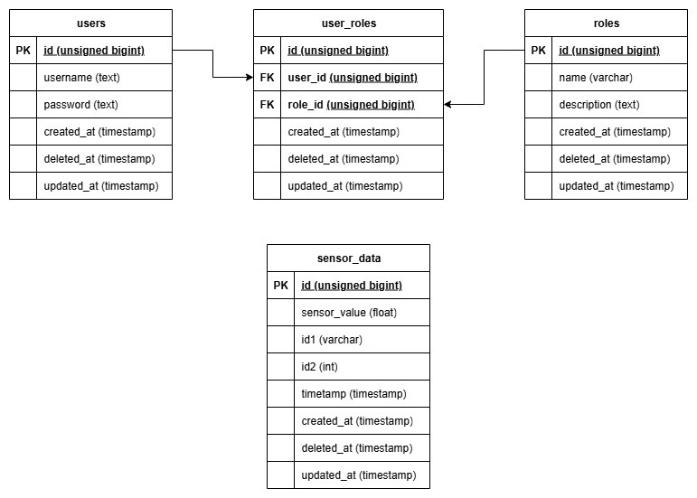

# Worlder Microservice Task

This project is a microservice-based system for producing and consuming sensor data. It consists of two main services: a `sensor-producer` that generates and publishes sensor data via MQTT, and a `sensor-consumer` that subscribes to the MQTT topic, processes the data, stores it in a database, and exposes a REST API for data retrieval and management.

## System Architecture

The system is composed of two main Go microservices:

*   **`sensor-producer`**: A service that simulates a sensor. It periodically generates data and publishes it to an MQTT topic. It also exposes an HTTP endpoint to dynamically change the frequency of data generation.
*   **`sensor-consumer`**: This service subscribes to the MQTT topic to receive sensor data. It then stores this data in a MySQL database and provides a RESTful API for clients to authenticate, retrieve, and manage the sensor data.

For a visual representation of the architecture and database schema, please refer to the `System Diagram.jpg` and `ERD.jpg` files in the repository.




### Features

*   **Microservice Architecture**: Decoupled services for production and consumption of data.
*   **Asynchronous Communication**: Utilizes MQTT for efficient and reliable messaging between services.
*   **RESTful APIs**: Both services expose RESTful APIs:
    *   The `sensor-producer` API allows administrators to control the data generation frequency.
    *   The `sensor-consumer` API allows users to retrieve sensor data and administrators to manage it.
*   **Authentication & Authorization**: Secures endpoints using JWT and role-based access control (admin, user).
*   **Containerized**: Fully containerized using Docker for easy setup and deployment.

### Technologies Used

*   **Backend**: Go
*   **Web Framework**: Echo
*   **Database**: MySQL
*   **ORM**: GORM
*   **Messaging**: MQTT (Eclipse Paho)
*   **Containerization**: Docker, Docker Compose
*   **Authentication**: JSON Web Tokens (JWT)

## Getting Started

### Prerequisites

*   Docker
*   Docker Compose

### Installation

1.  **Clone the repository:**
    ```sh
    git clone <repository-url>
    cd worlder-microservice-task
    ```

2.  **Create a `.env` file:**
    Create a file named `.env` in the root of the project with the following variables.

    ```env
    # Application Ports
    APP_PORT=8080

    # Database Configuration (for sensor-consumer)
    DB_HOST=your-mysql-host
    DB_PORT=3306
    DB_USER=your-db-user
    DB_PASSWORD=your-db-password
    DB_NAME=your-db-name

    # MQTT Broker Configuration
    MQTT_HOST=your-mqtt-broker-host
    MQTT_PORT=1883
    MQTT_TOPIC=sensors/data
    MQTT_USERNAME=
    MQTT_PASSWORD=

    # Security
    JWT_SECRET=your-jwt-secret-key
    DEFAULT_FREQUENCY=10
    ```

3.  **Run the application:**
    Use Docker Compose to build and run the services.
    ```sh
    docker-compose up -d --build
    ```

4.  **Access the services:**
    *   **Sensor Producer API**: `http://localhost:8080`
    *   **Sensor Consumer API**: `http://localhost:9080`

## API Endpoints

### Sensor Producer (`http://localhost:8080`)

*   **Change Sensor Frequency**
    *   **Endpoint**: `POST /sensor/:frequency`
    *   **Description**: Changes the frequency (in seconds) at which the sensor publishes data.
    *   **Authorization**: `Admin` role required.
    *   **Path Parameters**:
        *   `frequency` (integer, **required**): The interval in seconds for publishing sensor data.
    *   **Example**: `POST /sensor/5`

### Sensor Consumer (`http://localhost:9080`)

#### Authentication

*   **Login**
    *   **Endpoint**: `POST /login`
    *   **Description**: Authenticates a user and returns a JWT token.
    *   **Request Body**:
        ```json
        {
            "username": "your_username",
            "password": "your_password"
        }
        ```

#### Sensor Data

*   **Get Sensor Data**
    *   **Endpoint**: `GET /sensor`
    *   **Description**: Retrieves a paginated and filterable list of sensor data.
    *   **Authorization**: `User` or `Admin` role required.
    *   **Query Parameters**:
        *   `page` (integer, **required**): The page number for pagination.
        *   `length` (integer, **required**): The number of items per page.
        *   `sort` (string, **required**): The field to sort by (e.g., `created_at`).
        *   `order` (string, **required**): The sort order (`asc` or `desc`).
        *   `id1` (string, optional): Filter by a specific sensor type name (e.g., `Temperature`).
        *   `id2` (integer, optional): Filter by a specific sensor ID.
        *   `time_start` (datetime, optional): The start of a time range filter (Format: `YYYY-MM-DDTHH:MM:SSZ`).
        *   `time_end` (datetime, optional): The end of a time range filter (Format: `YYYY-MM-DDTHH:MM:SSZ`).

*   **Update Sensor Data**
    *   **Endpoint**: `PATCH /sensor` or `PATCH /sensor/:id`
    *   **Description**: Updates one or more sensor data entries. Can be used to update a single entry by its ID in the path, or multiple entries by using query parameters as filters.
    *   **Authorization**: `Admin` role required.
    *   **Path Parameters**:
        *   `id` (integer, optional): The ID of a specific sensor entry to update.
    *   **Query Parameters (for bulk updates)**:
        *   `id1`, `id2`, `time_start`, `time_end`: Used to filter the records to be updated if no `:id` is provided.
    *   **Request Body**:
        ```json
        {
            "sensor_value": 99.9
        }
        ```

*   **Delete Sensor Data**
    *   **Endpoint**: `DELETE /sensor` or `DELETE /sensor/:id`
    *   **Description**: Deletes one or more sensor data entries. Can be used to delete a single entry by its ID in the path, or multiple entries by using query parameters as filters.
    *   **Authorization**: `Admin` role required.
    *   **Path Parameters**:
        *   `id` (integer, optional): The ID of a specific sensor entry to delete.
    *   **Query Parameters (for bulk deletes)**:
        *   `id1`, `id2`, `time_start`, `time_end`: Used to filter the records to be deleted if no `:id` is provided.
